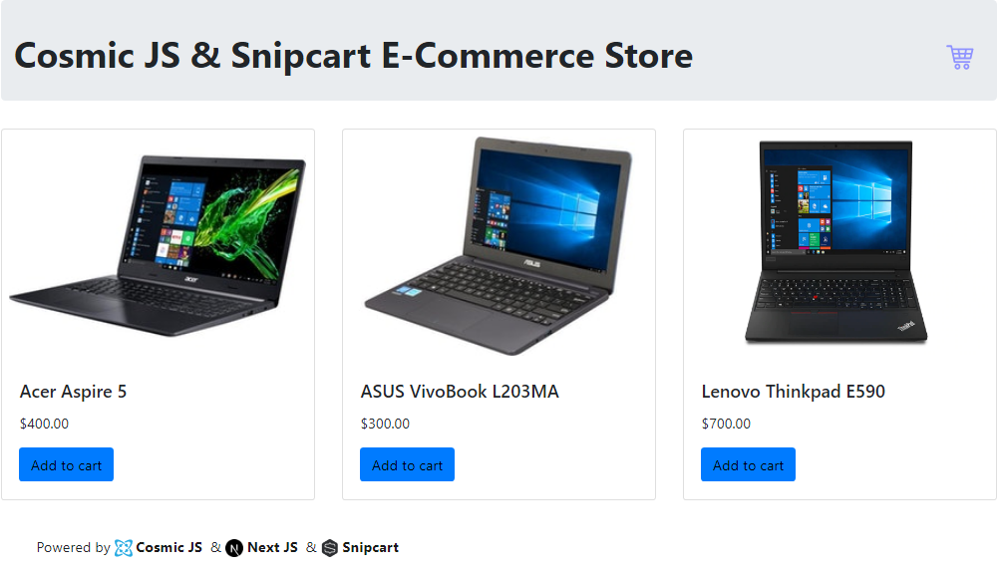

# Cosmic JS & Next JS E-commerce website




> This repo contains an example e-commerce website that is built with [Next.JS](https://nextjs.org/), [Cosmic JS](https://www.cosmicjs.com) and [Snipcart](https://snipcart.com/).

### [View Demo](https://nextjs-ecommerce-website.netlify.com/)

## Prerequisites
- Node (I recommend using latest version)
- Cosmic JS account
- Snipcart account

## Getting Started
``` bash
git clone https://github.com/sumitkharche/nextjs-ecommerce-website.git
cd nextjs-ecommerce-website
npm install or yarn install
```

### Run
``` bash
npm run dev
```
Open http://localhost:3000.

### Production
``` bash
npm run build & npm run start
```
